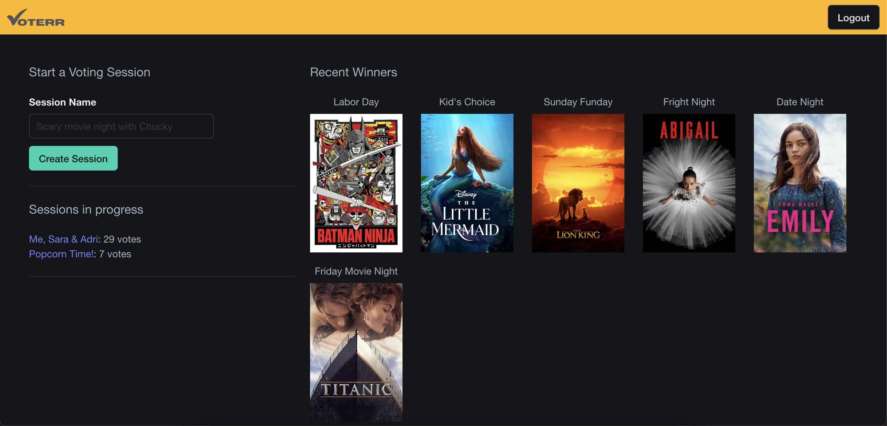
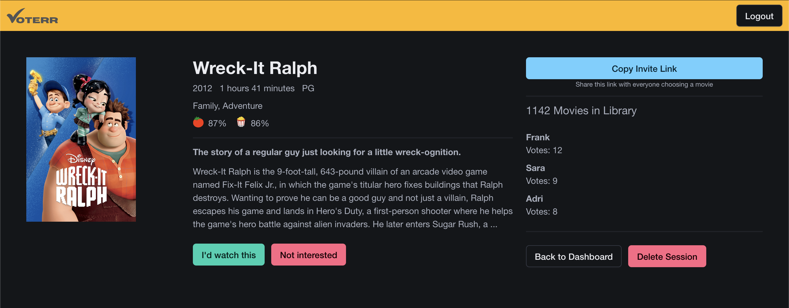
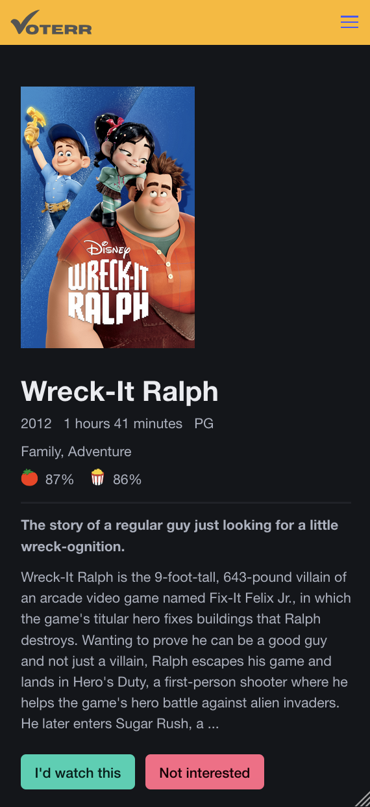

# Voterr

Voterr is an open-source web application that democratizes movie night decisions by allowing friends to vote on movies from a shared Plex library.

## Live App
[Voterr.tv](https://voterr.tv)


## Features

- Seamless integration with Plex libraries
- Create voting sessions and invite friends
- Real-time voting system
- Automatic winner declaration when all participants agree
- Mobile-responsive design
- Open movie in Plex from the winner page

## Screenshots
<table>
  <tr>
    <td align="center" width="33%">
      <br>
      <em>Dashboard - See past winners and ongoing voting sessions.</em>
    </td>
    <td align="center" width="33%">
      <br>
      <em>Vote Page - Vote on movies and get see the voting progress of friends.</em>
    </td>
    <td align="center" width="33%">
      <br>
      <em>Mobile - Everything looks good on mobile devices too</em>
    </td>
  </tr>
</table>

## Tech Stack

- Ruby 3.1.1
- Rails 7.1.4
- PostgreSQL 16
- Stimulus.js
- Bulma CSS Framework
- Plex API integration

## Getting Started

### Prerequisites

- Ruby 3.1.1
- Rails 7.1.4
- PostgreSQL 16
- Plex account and server

### Installation

1. Clone the repository
   ```
   git clone https://github.com/wheresfrank/voterr.git
   cd voterr
   ```

2. Install dependencies
   ```
   bundle install
   ```

3. Set up the database
   ```
   rails db:create db:migrate
   ```

4. Start the server
   ```
   rails server
   ```

5. Visit `http://localhost:3000` in your browser

## Usage

1. Log in to voterr.tv using your Plex account.
2. Your Plex movie library will be automatically imported.
3. Create a new voting session.
4. Copy the invite link and share it with your friends.
5. Friends can join the session by entering their names using the invite link.
6. Everyone votes on the available movies.
7. When a movie receives a positive vote from all participants, it's declared the winner.
8. The session creator can open the winning movie directly in Plex from the winner page.

## Contributing

We welcome contributions to Voterr! Please follow these steps to contribute:

1. Fork the repository
2. Create a new branch (`git checkout -b feature/AmazingFeature`)
3. Make your changes
4. Commit your changes (`git commit -m 'Add some AmazingFeature'`)
5. Push to the branch (`git push origin feature/AmazingFeature`)
6. Open a Pull Request

## License

This project is licensed under the GNU GENERAL PUBLIC LICENSE, Version 3 - see the [LICENSE.md](LICENSE.md) file for details.

## Acknowledgments

- Plex API for enabling seamless integration with users' movie libraries.

Project Link: [https://github.com/wheresfrank/voterr](https://github.com/wheresfrank/voterr)
